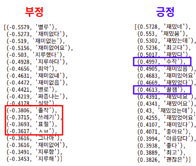
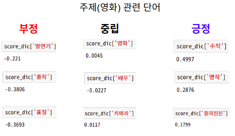
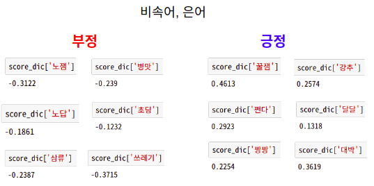

# **주제 별 한국어 감성 사전 Project**
감성 분석을 위해 필요한 감성사전을 배포하는 프로젝트입니다.
각각의 영역에 특화된 감성사전을 제작하여 무료로 제공합니다.


각 사전은 `csv`, `json` 파일 형태로 저장되어 있습니다.

### 다운로드
``` markdown
git clone https://github.com/DonghyungKo/sentiment_dictionary.git
```


---
## **영화 리뷰 감성사전 (Movie Sentiment Dictionary v1.0)**
영화 리뷰 감성사전은 영화 분야에 특화된 감성 어휘들을 포함하고 있는 사전입니다.

> 사전 생성에 필요한 데이터는 [lucy_park (e9t)](https://github.com/e9t/nsmc)님이 공유 해주신 데이터를 활용하였습니다.

### **링크**
- **[movie_sentiment_dictionary.csv](https://github.com/DonghyungKo/sentiment_dictionary/blob/master/movie/movie_sentiment_dictionary.csv)**
- **[movie_sentiment_dictionary.json](https://github.com/DonghyungKo/sentiment_dictionary/blob/master/movie/movie_sentiment_dictionary.json)**


### Quick View







